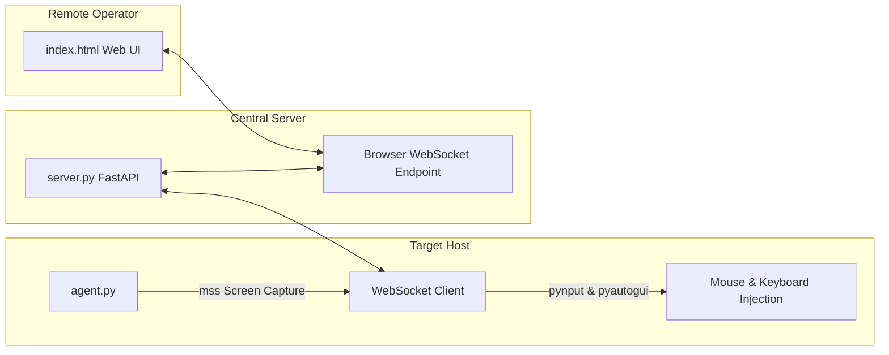

# 🌐 RT: Web-Based Remote Desktop & Control Suite

**RT** is a browser-based remote access and administration platform. It enables operators to monitor and interact with a remote Windows desktop directly within any standard modern web browser—with no client-side browser extensions or desktop viewer installations required.

The system relies on an asynchronous architecture powered by **FastAPI**, **WebSockets**, **mss**, and **pynput** for high frame rates and ultra-low latency.

---

## 🏗️ Architecture & Data Flow



---

## 🌟 Key Features

1. **Zero-Install Web Viewer (`index.html`)**:
   - Access the remote desktop from any modern browser (Chrome, Edge, Firefox, Safari) on desktops, tablets, or mobile devices.
   - Interactive HTML5 canvas with real-time mouse coordinate mapping, scroll events, and keyboard forwarding.
2. **High-Performance Screen Capture**:
   - Uses `mss` (C-based DirectX screen capture) for low CPU overhead.
   - Dynamically optimizes and compresses frames into JPEG format.
3. **Responsive Input Forwarding**:
   - Accurate cursor positioning, click events (left, right, double-click), and specialized key mappings (Enter, Backspace, Ctrl, Shift, Tab, etc.) via `pynput` and `pyautogui`.
4. **Latency Measurement (`verify_remote.py`)**:
   - Built-in verification script to measure network latency and roundtrip packet times.
5. **Standalone Executable Packaging (`agent.spec`)**:
   - Ready-to-build PyInstaller specification for compiling `agent.py` into a single, standalone executable.

---

## 📁 Repository Structure

```text
RT/
├── server.py          # FastAPI server & WebSocket relay broker
├── agent.py           # Endpoint capture agent (runs on target host)
├── index.html         # Interactive browser client interface
├── verify_remote.py   # Latency and connectivity test script
├── agent.spec         # PyInstaller build specification
├── .gitignore         # Ignores build artifacts and compiled binaries
└── README.md          # Project documentation
```

---

## 🚀 Installation & Running

### Prerequisites
- Python 3.9 or higher.
- Install the required Python packages:
  ```bash
  pip install fastapi uvicorn websockets pyautogui pynput mss pillow requests
  ```

### Step 1: Start the Relay Server
On your server or local machine:
```bash
python server.py
```
- The server starts on port `8000`.
- Open your browser and navigate to: **`http://localhost:8000`**

### Step 2: Start the Agent on the Target Machine
1. In `agent.py`, update `SERVER_WS_URL` if the server is hosted on another machine:
   ```python
   SERVER_WS_URL = "ws://<YOUR_SERVER_IP>:8000/ws/agent"
   ```
2. Run the agent:
   ```bash
   python agent.py
   ```
3. The agent connects to the relay server and immediately begins streaming the desktop.

### Step 3: Remote Control via Web Browser
Navigate to `http://<YOUR_SERVER_IP>:8000` in any web browser. You will see the live desktop feed and can immediately begin controlling the system using your mouse and keyboard.

### Step 4: Compiling Agent to a Standalone Executable (Optional)
To generate an independent executable that does not require Python on the target host:
```bash
pip install pyinstaller
pyinstaller agent.spec
```
The compiled executable will be located in the `dist/` directory.

---

## ⚠️ Disclaimer
This project is developed solely for educational research, remote support demonstration, and authorized administrative testing.
